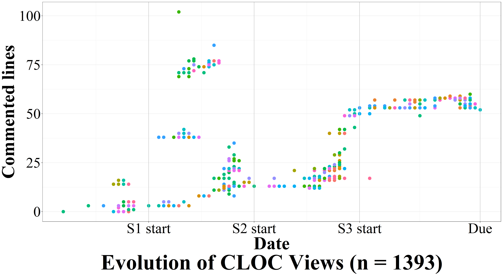
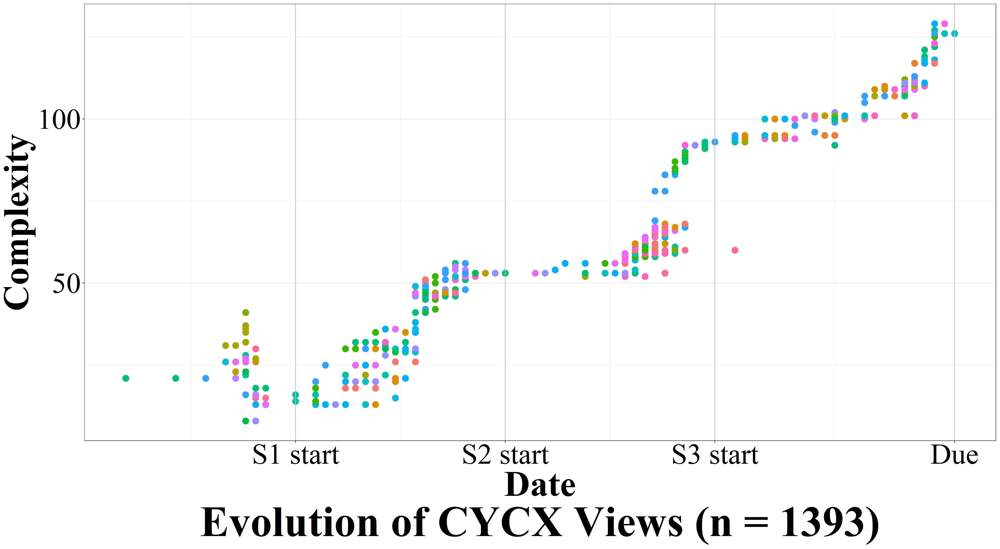
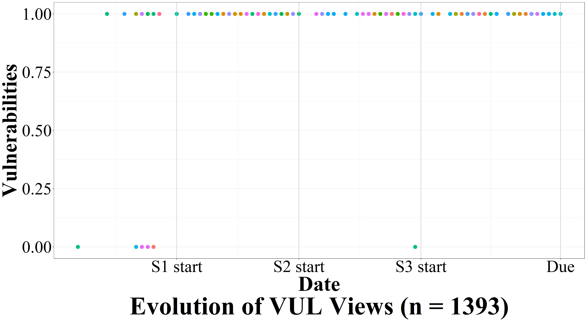

Measuring students' source code quality in software development projects through commit-impact analysis
======

Table of contents
------
* [Extent impactful commits](#extent-impactful-commits)
    * [Ratio of impactful commits](#ratio-of-impactful-commits)
    * [Ratio of impactful developers](#ratio-of-impactful-developers)
* [Compilable impactful commits](#compilable-impactful-commits)
    * [Ratio of compilable impactful commits](#ratio-of-compilable-impactful-commits)
    * [Ratio of compilable impactful commits](#ratio-of-compilable-impactful-commits)
    * [Compilation errors impactful commits](#compilation-errors-impactful-commits)
    * [Non-compilable impactful commits over time](#non-compilable-impactful-commits-over-time)
* [Quality impactful commits](#quality-impactful-commits)
    * [Ratio of change compilable impactful commits](#ratio-of-change-compilable-impactful-commits)
    * [Evolution of metrics](#evolution-of-metrics)
    * [Impact of metrics](#impact-of-metrics)
* [Change indicator](#change-indicator)

## Extent impactful commits

### Ratio of impactful commits

#### Total

| Submodule             | All   |  Impactful    | Impactful %       |
|---                    |---    |---            |---                |
| controllers           | 2253  |  1343         | 59.61  |
| models                | 2253  |  837          | 37.15   |
| views                 | 2253  |  1439         | 63.87  |
| _average_             | -     | -             | 53.54  |
| _weighted average_    | -     | -             | 56.11  |
| _standard derivation_ | -     | -             | 11.72  |

#### Commits

| Submodule             | All   |  Impactful    | Impactful %       |
|---                    |---    |---            |---                |
| controllers           | 1431  | 617           | 43.12  |
| models                | 1431  | 277           | 19.36  |
| views                 | 1431  | 712           | 49.76 |
| _average_             | -     | -             | 37.41  |
| _weighted average_    | -     | -             | 41.96  |
| _standard derivation_ | -     | -             | 13.05  |

#### Merges

| Submodule             | All   |  Impactful    | Impactful %       |
|---                    |---    |---            |---                |
| controllers           | 822   |  726          | 88.32  |
| models                | 822   |  560          | 68.13  |
| views                 | 822   |  727          | 88.44  |
| _average_             | -     |  -            | 81.63  |
| _weighted average_    | -     |  -            | 82.75   |
| _standard derivation_ | -     |  -            | 9.55  |

### Ratio of impactful developers

#### Total

| Submodule             | All  |  Impactful | Impactful %   |
|---                    |---   |---         |---            |
| controllers           | 20   | 20         | 100           |
| models                | 20   | 20         | 100           |
| views                 | 20   | 20         | 100           |
| _average_             | -    | -          | 100           |
| _weighted average_    | -    | -          | 100           |
| _standard derivation_ | -    | -          | 0             |

#### Commits

| Submodule             | All  |  Impactful | Impactful %   |
|---                    |---   |---         |---            |
| controllers           | 20   | 20         | 100           |
| models                | 20   | 20         | 100           |
| views                 | 20   | 20         | 100           |
| _average_             | -    | -          | 100           |
| _weighted average_    | -    | -          | 100           |
| _standard derivation_ | -    | -          | 0             |

#### Merges

| Submodule             | All  |  Impactful | Impactful %   |
|---                    |---   |---         |---            |
| controllers           | 20   | 20         | 100           |
| models                | 20   | 20         | 100           |
| views                 | 20   | 20         | 100           |
| _average_             | -    | -          | 100           |
| _weighted average_    | -    | -          | 100           |
| _standard derivation_ | -    | -          | 0             |

## Compilable impactful commits

### General information

| Commit type | Number of errors    |  Number of students with errors   |
|---          |---                  |---                                |
| Commit      | 22                  | 9                                 |
| Merges      | 44                  | 17                                |
| _total_     | 66                  | 18                                |

### Ratio of compilable impactful commits

#### Total

| Submodule             | All   |  Impactful    | Impactful %       |
|---                    |---    |---            |---                |
| controllers           | 1343  |  1283         | 95.53 |
| models                | 837   |  784          | 93.67  |
| views                 | 1439  |  1393         | 96.80  |
| _average_             | -     | -             | 95.33  |
| _weighted average_    | -     | -             | 95.62   |
| _standard derivation_ | -     | -             | 1.29  |

#### Commits

| Submodule             | All   |  Impactful    | Impactful %       |
|---                    |---    |---            |---                |
| controllers           | 617   | 600           | 97.24  |
| models                | 277   | 266           | 96.03   |
| views                 | 712   | 708           | 99.44   |
| _average_             | -     | -             | 97.57  |
| _weighted average_    | -     | -             | 98.03 |
| _standard derivation_ | -     | -             | 1.41  |

#### Merges

| Submodule             | All   |  Impactful    | Impactful %       |
|---                    |---    |---            |---                |
| controllers           | 726   |  683          | 94.08  |
| models                | 560   |  518          | 92.50              |
| views                 | 727   |  685          | 94.22   |
| _average_             | -     |  -            | 93.60  |
| _weighted average_    | -     |  -            | 93.70   |
| _standard derivation_ | -     |  -            | 0.78 |

### Compilation errors impactful commits

| Error code    | Error description | Times | Self-declared code |
|---            |--- |--- |--- |
| CS0246        | Missing namespace | 73 | No |
| CS1061        | Missing definition | 53 | No |
| CS2001        | Missing file | 48 | No |
| CS0111        | Repeated definition | 23 | No |
| CS8300        | Merge conflict  marker | 3 | No |
| M3            | Missing storage schema node | 3 | No |
| CS0116        | Namespace with fields or methods | 2 | No |
| CS0161        | Missing returns | 2 | No |
| MSB3105       | Multiple sources | 2 | No |
| CS0103        | Name does not exist in context | 2 | No |
| M1            | Error processing the model | 1 | Yes |
| M2            | Path not found | 1 | Yes |
| MSB3249       | Invalid web.config characters | 1 | No |
| CS1513        | Expected } | 1 | No |
| MSB4025       | Could not load project file | 1 | No |
| CS0127        | Return error | 1 | No |
| CS1003        | Syntax error “,” | 1 | No |
| CS1501        | No overload method | 1 | No |
| CS1579        | Foreach cannot operate on variable | 1 | No |
| CS7036        | No argument | 1 | No |
| CS1009        | Unrecognized escape sequence | 1 | No |
| CS0029        | Cannot implicitly convert | 1 | No |

### Non-compilable impactful commits over time

## Quality impactful commits

### Ratio of change compilable impactful commits

#### Total
| Submodule             | LOC   | FN   | CL   | CLOC   | CYCX   | COCX   | DL   | DF   | CS   | TD   | VUL   |
|---                    |---    |---    |---    |---    |---    |---    |---    |---    |---    |---    |---    |
| controllers           | 87.16 (&#x25B2; 73.06 &#x25BC; 14.10) | 54.91(&#x25B2; 46.99 &#x25BC; 7.92) | 23.06 (&#x25B2; 18.86 &#x25BC; 4.20) | 66.16 (&#x25B2; 49.76 &#x25BC; 16.40) | 75.12 (&#x25B2; 63.23 &#x25BC; 11.89) | 67.51 (&#x25B2; 55.94 &#x25BC; 11.57) | 13.47(&#x25B2; 9.51 &#x25BC; 3.96) | 7.53 (&#x25B2; 5.55 &#x25BC; 1.98)  | 72.82 (&#x25B2; 50.71 &#x25BC; 22.11) | 66.09 (&#x25B2; 43.34 &#x25BC; 22.74)  | 0.00 (&#x25B2; 0.00 &#x25BC; 0.00) |
| models                | 60.86 (&#x25B2; 56.68 &#x25BC; 4.19) | 51.83 (&#x25B2; 48.17 &#x25BC; 3.66) | 31.68 (&#x25B2; 30.24 &#x25BC; 1.443) | 28.93 (&#x25B2; 23.95 &#x25BC; 4.97) | 53.01 (&#x25B2; 49.61 &#x25BC; 3.40) | 20.16 (&#x25B2; 19.37 &#x25BC; 0.79) | 4.97 (&#x25B2; 4.97 &#x25BC; 0.00) | 4.45 (&#x25B2; 4.45 &#x25BC; 0) | 48.17 (&#x25B2; 40.84 &#x25BC; 7.33) | 45.16 (&#x25B2; 37.83 &#x25BC; 7.33) | 0.00 (&#x25B2; 0.00 &#x25BC; 0.00) |
| views                 | 87.52 (&#x25B2; 69.77 &#x25BC; 17.75) | 0.07 (&#x25B2; 0.07 &#x25BC; 0.00) | 0.00 (&#x25B2; 0.00 &#x25BC; 0.00) | 26.70 (&#x25B2; 17.32 &#x25BC; 9.38) | 32.54 (&#x25B2; 27.71 &#x25BC; 4.83) | 0.07 (&#x25B2; 0.00 &#x25BC; 0.07) | 36.36 (&#x25B2; 21.21 &#x25BC; 15.15) | 26.62 (&#x25B2; 17.10 &#x25BC; 9.52) | 22.37 (&#x25B2; 17.10 &#x25BC; 5.27) | 22.08 (&#x25B2; 16.88 &#x25BC; 5.19) | 0.94 (&#x25B2; 0.79 &#x25BC; 0.14) |
| _average_             | 78.52 (&#x25B2; 66.50 &#x25BC; 12.01) | 35.61 (&#x25B2; 31.74 &#x25BC; 3.86) | 18.24 (&#x25B2; 16.36 &#x25BC; 1.88) | 40.60 (&#x25B2; 30.34 &#x25BC; 10.25) | 53.56 (&#x25B2; 46.85 &#x25BC; 6.71) | 29.25 (&#x25B2; 25.10 &#x25BC; 4.14) | 18.27 (&#x25B2; 11.90 &#x25BC; 6.37) | 12.87 (&#x25B2; 9.03 &#x25BC; 3.83) | 47.78 (&#x25B2; 36.22 &#x25BC; 11.57) | 44.44 (&#x25B2; 32.68 &#x25BC; 11.76) | 0.31 (&#x25B2; 0.26 &#x25BC; 0.05) |
| _weighted average_    | 82.92 (&#x25B2; 68.63 &#x25BC; 15.37) | 53.74 (&#x25B2; 47.39 &#x25BC; 6.99) | 26.97 (&#x25B2; 24.46 &#x25BC; 3.73) | 50.15 (&#x25B2; 37.86 &#x25BC; 12.81) | 59.51 (&#x25B2; 51.19 &#x25BC; 9.03) | 60.20 (&#x25B2; 49.61 &#x25BC; 11.07) | 29.22 (&#x25B2; 16.74 &#x25BC; 13.00) | 21.47 (&#x25B2; 13.47 &#x25BC; 8.32) | 57.35 (&#x25B2; 41.42 &#x25BC; 17.07) | 52.16 (&#x25B2; 36.07 &#x25BC; 17.62) | 0.94 (&#x25B2; 0.79 &#x25BC; 0.14) |
| _standard derivation_ | 12.48 (&#x25B2; 7.08 &#x25BC; 5.73) | 25.16 (&#x25B2; 22.40 &#x25BC; 3.24) | 13.37 (&#x25B2; 12.47 &#x25BC; 1.74) | 18.10 (&#x25B2; 14.00 &#x25BC; 4.71) | 17.39 (&#x25B2; 14.63 &#x25BC; 3.71) | 28.27 (&#x25B2; 23.20 &#x25BC; 5.26) | 13.26 (&#x25B2; 6.84 &#x25BC; 6.42) | 9.81 (&#x25B2; 5.72 &#x25BC; 4.10) | 20.60 (&#x25B2; 14.11 &#x25BC; 7.50) | 17.97 (&#x25B2; 11.40 &#x25BC; 7.82) | 0.44 (&#x25B2; 0.37 &#x25BC; 0.07) |

#### Commits

| Submodule             | LOC   | FN   | CL   | CLOC   | CYCX   | COCX   | DL   | DF   | CS   | TD   | VUL   |
|---                    |---    |---    |---    |---    |---    |---    |---    |---    |---    |---    |---    |
| controllers           | 79.62 (&#x25B2; 64.25 &#x25BC; 15.37) | 37.65 (&#x25B2; 31.43 &#x25BC; 6.22) | 10.36 (&#x25B2; 8.64 &#x25BC; 1.73) | 48.88 (&#x25B2; 34.54 &#x25BC; 14.34) | 62.69 (&#x25B2; 51.64 &#x25BC; 11.05) | 51.47 (&#x25B2; 41.45 &#x25BC; 10.02) | 3.97 (&#x25B2; 2.59 &#x25BC; 1.38) | 2.25 (&#x25B2; 1.55 &#x25BC; 0.69) | 58.72 (&#x25B2; 37.82 &#x25BC; 20.90) | 50.60 (&#x25B2; 30.92 &#x25BC; 19.69) | 0.00 (&#x25B2; 0.00 &#x25BC; 0.00) |
| models                | 45.53 (&#x25B2; 40.24 &#x25BC; 5.28) | 33.74 (&#x25B2; 30.08 &#x25BC; 3.66) | 15.45 (&#x25B2; 13.82 &#x25BC; 1.63) | 13.41 (&#x25B2; 9.35 &#x25BC; 4.07) | 35.77 (&#x25B2; 32.52 &#x25BC; 3.25) | 10.16 (&#x25B2; 9.35 &#x25BC; 0.81) | 1.63 (&#x25B2; 1.63 &#x25BC; 0.00) | 1.22 (&#x25B2; 1.22 &#x25BC; 0.00) | 29.27 (&#x25B2; 22.35 &#x25BC; 6.91) | 27.24 (&#x25B2; 20.33 &#x25BC; 6.91) | 0.00 (&#x25B2; 0.00 &#x25BC; 0.00) |
| views                 | 81.60 (&#x25B2; 60.20 &#x25BC; 21.40) | 0.14 (&#x25B2; 0.14 &#x25BC; 0) | 0.00 (&#x25B2; 0.00 &#x25BC; 0.00) | 13.12 (&#x25B2; 8.70 &#x25BC; 4.42) | 17.12 (&#x25B2; 14.27 &#x25BC; 2.85) | 0.14 (&#x25B2; 0.00 &#x25BC; 0.14) | 19.97 (&#x25B2; 10.13 &#x25BC; 9.84) | 12.84 (&#x25B2; 8.13 &#x25BC; 4.71) | 8.56 (&#x25B2; 6.13 &#x25BC; 2.43) | 8.13 (&#x25B2; 5.99 &#x25BC; 2.14) | 0.57 (&#x25B2; 0.43 &#x25BC; 0.14) |
| _average_             | 68.92 (&#x25B2; 54.90 &#x25BC; 14.02) | 23.84 (&#x25B2; 20.55 &#x25BC; 3.29) | 8.60 (&#x25B2; 7.49 &#x25BC; 1.12) | 25.14 (&#x25B2; 17.53 &#x25BC; 7.61) | 38.53 (&#x25B2; 32.81 &#x25BC; 5.72) | 20.59 (&#x25B2; 16.93 &#x25BC; 3.66) | 8.52 (&#x25B2; 4.78 &#x25BC; 3.74) | 5.43 (&#x25B2; 3.64 &#x25BC; 1.80) | 32.18 (&#x25B2; 22.11 &#x25BC; 10.08) | 28.66 (&#x25B2; 19.08 &#x25BC; 9.58) | 0.19 (&#x25B2; 0.14 &#x25BC; 0.05) |
| _weighted average_    | 77.27 (&#x25B2; 59.67 &#x25BC; 18.44) | 36.45 (&#x25B2; 30.92 &#x25BC; 5.71) | 12.33 (&#x25B2; 10.73 &#x25BC; 1.70) | 37.95 (&#x25B2; 26.95 &#x25BC; 11.03) | 48.97 (&#x25B2; 40.64 &#x25BC; 8.59) | 48.12 (&#x25B2; 38.64 &#x25BC; 9.55) | 17.33 (&#x25B2; 8.49 &#x25BC; 8.96) | 11.21 (&#x25B2; 6.97 &#x25BC; 4.27) | 47.85 (&#x25B2; 30.84 &#x25BC; 17.34) | 41.04 (&#x25B2; 25.10 &#x25BC; 16.40) | 0.57 (&#x25B2; 0.423 &#x25BC; 0.14) |
| _standard derivation_ | 16.56 (&#x25B2; 10.49 &#x25BC; 6.65) | 16.84 (&#x25B2; 14.44 &#x25BC; 2.55) | 6.43 (&#x25B2; 5.70 &#x25BC; 0.79) | 16.79 (&#x25B2; 12.03 &#x25BC; 4.76) | 18.71 (&#x25B2; 15.26 &#x25BC; 3.78) | 22.21 (&#x25B2; 17.75 &#x25BC; 4.51) | 8.15 (&#x25B2; 3.80 &#x25BC; 4.35) | 5.25 (&#x25B2; 3.18 &#x25BC; 2.08) | 20.58 (&#x25B2; 12.94 &#x25BC; 7.87) | 17.37 (&#x25B2; 10.21 &#x25BC; 7.41) | 0.27 (&#x25B2; 0.20 &#x25BC; 0.07) |

#### Merges

| Submodule             | LOC   | FN   | CL   | CLOC   | CYCX   | COCX   | DL   | DF   | CS   | TD   | VUL   |
|---                    |---    |---    |---    |---    |---    |---    |---    |---    |---    |---    |---    |
| controllers           | 93.56 (&#x25B2; 80.53&#x25BC; 13.03) | 69.55 (&#x25B2; 60.18 &#x25BC; 9.37) | 33.82 (&#x25B2; 27.53 &#x25BC; 6.30) | 80.82 (&#x25B2; 62.66 &#x25BC; 18.16) | 85.65 (&#x25B2; 73.06 &#x25BC; 12.59) | 81.11 (&#x25B2; 68.23 &#x25BC; 12.88) | 21.52 (&#x25B2; 15.37 &#x25BC; 6.15) | 12.01 (&#x25B2; 8.93 &#x25BC; 3.07) | 84.77 (&#x25B2; 61.64 &#x25BC; 23.13) | 79.21 (&#x25B2; 53.88 &#x25BC; 25.33) | 0.00 (&#x25B2; 0.00 &#x25BC; 0.00) |
| models                | 68.15 (&#x25B2; 64.48 &#x25BC; 3.67) | 60.42 (&#x25B2; 56.76 &#x25BC; 3.67) | 39.38 (&#x25B2; 38.03 &#x25BC; 1.35) | 36.29 (&#x25B2; 30.89 &#x25BC; 5.41) | 61.20 (&#x25B2; 57.72 &#x25BC; 3.47) | 24.90 (&#x25B2; 24.13 &#x25BC; 0.77) | 6.56 (&#x25B2; 6.56 &#x25BC; 0.00) | 5.98 (&#x25B2; 5.98 &#x25BC; 0.00) | 57.14 (&#x25B2; 49.61 &#x25BC; 7.53) | 53.67 (&#x25B2; 46.14 &#x25BC; 7.53) | 0.00 (&#x25B2; 0.00 &#x25BC; 0.00) |
| views                 | 93.58 (&#x25B2; 79.56 &#x25BC; 14.01) | 0.00 (&#x25B2; 0.00 &#x25BC; 0.00) | 0.00 (&#x25B2; 0.00 &#x25BC; 0.00) | 40.58 (&#x25B2; 26.13 &#x25BC; 14.45) | 48.32 (&#x25B2; 41.46 &#x25BC; 6.86) | 0.00 (&#x25B2; 0.00 &#x25BC; 0.00) | 53.14 (&#x25B2; 32.55 &#x25BC; 20.58) | 40.73 (&#x25B2; 26.28 &#x25BC; 14.45) | 36.50 (&#x25B2; 28.32 &#x25BC; 8.18) | 36.35 (&#x25B2; 28.03 &#x25BC; 8.32) | 1.31 (&#x25B2; 1.17 &#x25BC; 0.15) |
| _average_             | 85.09 (&#x25B2; 74.86 &#x25BC; 10.24) | 43.32 (&#x25B2; 38.98 &#x25BC; 4.35) | 24.40 (&#x25B2; 21.85 &#x25BC; 2.55) | 52.57 (&#x25B2; 39.89 &#x25BC; 12.67) | 65.06 (&#x25B2; 57.41 &#x25BC; 7.64) | 35.34 (&#x25B2; 30.79 &#x25BC; 4.55) | 27.08 (&#x25B2; 18.16 &#x25BC; 8.91) | 19.57 (&#x25B2; 13.73 &#x25BC; 5.84) | 59.47 (&#x25B2; 46.52 &#x25BC; 12.95) | 56.41 (&#x25B2; 42.68 &#x25BC; 13.73) | 0.44 (&#x25B2; 0.39 &#x25BC; 0.05) |
| _weighted average_    | 88.07 (&#x25B2; 76.41 &#x25BC; 12.62) | 65.92 (&#x25B2; 58.75 &#x25BC; 8.07) | 36.43 (&#x25B2; 32.90 &#x25BC; 5.60) | 61.61 (&#x25B2; 47.51 &#x25BC; 15.27) | 69.34 (&#x25B2; 60.53 &#x25BC; 9.72) | 70.50 (&#x25B2; 58.90 &#x25BC; 12.36) | 41.717 (&#x25B2; 25.13 &#x25BC; 17.27) | 31.97 (&#x25B2; 20.07 &#x25BC; 12.46) | 66.78 (&#x25B2; 50.68 &#x25BC; 17.42) | 62.57 (&#x25B2; 45.35 &#x25BC; 19.14) | 1.31 (&#x25B2; 1.17 &#x25BC; 0.15) |
| _standard derivation_ | 11.98 (&#x25B2; 7.35 &#x25BC; 4.66) | 30.86 (&#x25B2; 27.60 &#x25BC; 3.86) | 17.40 (&#x25B2; 16.04 &#x25BC; 2.71) | 20.06 (&#x25B2; 16.22 &#x25BC; 5.36) | 15.48 (&#x25B2; 12.90 &#x25BC; 3.76) | 33.93 (&#x25B2; 28.25 &#x25BC; 5.90) | 19.42 (&#x25B2; 10.79 &#x25BC; 8.63) | 15.16 (&#x25B2; 8.95 &#x25BC; 6.22) | 19.78 (&#x25B2; 13.78 &#x25BC; 7.21) | 17.60 (&#x25B2; 10.83 &#x25BC; 8.21) | 0.62 (&#x25B2; 0.55 &#x25BC; 0.07) |

### Evolution of metrics

#### Lines of code (LOC)

##### Controllers

##### Models

##### Views

#### Functions (FN)

##### Controllers

##### Models

##### Views

#### Classes (CL)

##### Controllers

##### Models

##### Views

#### Commented lines of code (CLOC)

##### Controllers

##### Models

##### Views

#### Cyclomatic complexity (CYCX)

##### Controllers

##### Models

##### Views

#### Cognitive complexity (COCX)

##### Controllers

##### Models

##### Views

#### Duplicated lines (DL)

##### Controllers

##### Models

##### Views

#### Duplicated files (DF)

##### Controllers

##### Models

##### Views

#### Code smells (CS)

##### Controllers

##### Models

##### Views

#### Technical debt (TD)

##### Controllers

##### Models

##### Views

#### Vulnerabilities (VUL)

##### Controllers

##### Models

##### Views

### Impact of metrics

#### Lines of code (LOC)

##### Controllers

##### Models

##### Views

#### Functions (FN)

##### Controllers

##### Models

##### Views

#### Classes (CL)

##### Controllers

##### Models

##### Views

#### Commented lines of code (CLOC)

##### Controllers

##### Models

##### Views

#### Cyclomatic complexity (CYCX)

##### Controllers

##### Models

##### Views

#### Cognitive complexity (COCX)

##### Controllers

##### Models

##### Views

#### Duplicated lines (DL)

##### Controllers

##### Models

##### Views

#### Duplicated files (DF)

##### Controllers

##### Models

##### Views

#### Code smells (CS)

##### Controllers

##### Models

##### Views

#### Technical debt (TD)

##### Controllers

##### Models

##### Views

#### Vulnerabilities (VUL)

##### Controllers

##### Models

##### Views

## Change indicator

### Ratio of change between quality attributes

|         | LOC   | FN   | CL   | CLOC   | CYCX   | COCX   | DL   | DF   | CS   | TD   | VUL   |
|---      |---    |---    |---    |---    |---    |---    |---    |---    |---    |---    |---    |
|**LOC**  | -| 0.00 | 0.00 | 5.53 | 5.03 | 5.53 | 2.01 | 1.01 | 7.54 | 5.53 | 0.50 |
|**FN**   | 79.10 | - | 0.95 | 29.73 | 29.83 | 25.63 | 16.39 | 8.72 | 33.72 | 28.57 | 0.32 |
|**CL**   | 85.02 | 28.99 | - | 42.39 | 50.00 | 39.53 | 22.21 | 13.48 | 46.69 | 40.66 | 0.30 | 
|**CLOC** | 75.99 | 14.56 | 2.30 | - | 30.65 | 19.54 | 14.30 | 8.05 | 26.18 | 20.31 | 0.00 |
|**CYCX** | 71.92 | 0.74 | 1.34 | 19.32 | - | 3.71 | 11.89 | 5.05 | 22.59 | 17.83 | 0.30 |
|**COCX** | 77.78 | 16.31 | 5.08 | 25.53 | 23.40 | - | 14.66 | 7.80 | 30.02 | 23.17 | 0.35 |
|**DL**   | 83.28 | 31.73 | 11.41 | 42.45 | 49.14 | 38.08 | - | 0.09 | 47.51 | 41.25 | 0.43 |
|**DF**   | 84.94 | 33.56 | 12.16 | 44.95 | 51.15 | 40.37 | 10.93 | - | 49.31 | 43.81 | 0.38 |
|**CS**   | 74.27 | 11.75 | 0.98 | 19.16 | 27.13 | 17.20 | 14.41 | 7.27 | - | 7.83 | 0.42 |
|**TD**   | 76.47 |14.89 | 1.38 | 21.90 | 30.79 | 18.65 | 14.27 | 8.01 | 17.52 | - | 0.38 |
|**VUL**  | 88.43 | 44.54 | 22.62 | 54.24 | 60.78 | 50.73 | 32.14 | 23.85 | 58.39 | 53.48 | - |